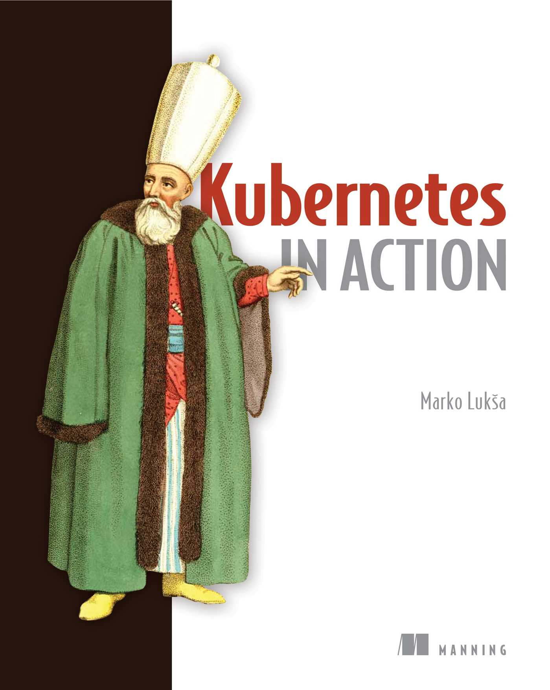
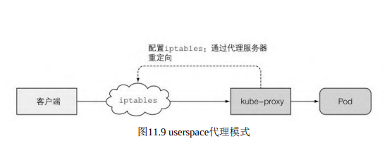
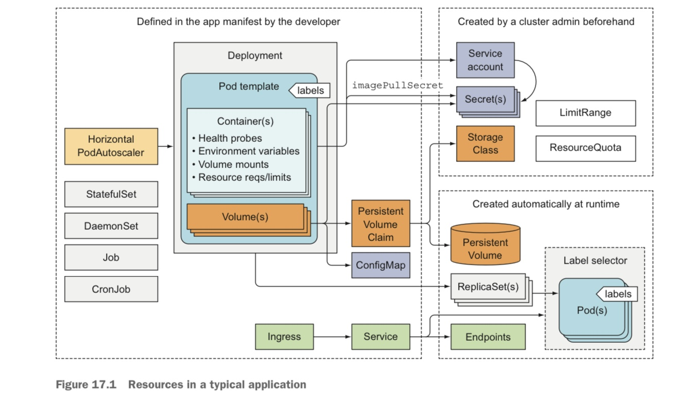
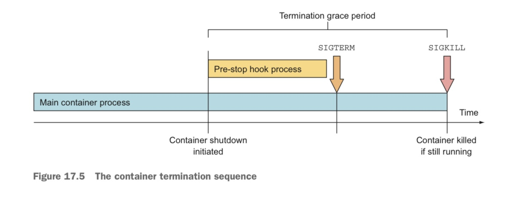
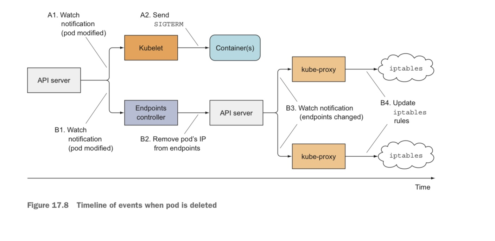

# Kubernetes in Action  


个人评分: ⭐️⭐️⭐️  

全面但不太底层。适合了解和入门。 


# 一 概念

## 1. Pod

Pod是k8s调度管理的最小单位。

一个Pod包含一个或多个Container(容器)。

一个Container可以包含多个进程，但是实践中一般只有一个进程。

一个Pod内的Container保证不会被调度到不同的Node上，而且它们一定是在相同的Linux Namespace下，which means它们可以通过localhost通信，也可以访问相同的文件。

Pod是逻辑上的一台主机，它执行现实中一台主机的功能。运行在同一个Pod中的进程和实际运行在同一个主机或者虚拟机内一样，只不过它们都被包在了一个Container容器中。

- Pod相当于将一个物理主机的资源分成多份，每一份是一个Pod，容器Container是每个Pod中的进程，同时依赖于容器的标准化，实现了进程的隔离、部署和管理。

## 2. Label

Label是一组键值对，可以通过配置文件或者kubectl命令向k8s中的一个资源对象添加标签Label。

通过Label可以对一组资源进行管理，比如将包含某个Label的Pod调度到某个Node上。

同时也可以添加Label，在Pod的配置中通过”nodeSelector”可以选择把Pod调度到包含某个Label的Node上。

## 3. Annotation 注解

和标签Label一样，Annotation注解也是附加在资源对象上的键值对。

和Label不同的是：

- 注解没有对应的选择器，这意味着不能通过Annotation对某一组资源进行管理
- 注解的值的大小比Label大，Label一般很短，但是注解可以相对比较大(最大256K)
- 注解的目的与Label不同，Label是用来成组地管理一批资源对象，注解主要用来添加对资源对象的说明，是为工具设计的，大多时候会用注解的都是一些工具和库，也因此注解应该使用类似Java包的域名式来命名Key，以此避免Key的冲突导致的互相覆盖。

### 4. Namespace 命名空间

Namespace也是资源分组的一种方式，不过与Label不同的是Namespace不能互相重合。

Node对象因为是全局唯一的，所以不能划分Namespace。同样还有PersistentVolume。

Namespace之间的资源是互相隔离的。

# 二 部署与管理

## Service

### Headless Service

### 服务链接排错

当客户端无法连接到你服务所在的Pod时可以通过以下方式来排查错误

- 首先，确定你连接服务的cluster IP的时候是从集群内连接的，不是从集群外
- 不要尝试去Ping服务IP，因为它是虚拟IP，是无法Ping通的。
- 如果你定义了就绪探针，确定你的Pod是处于就绪状态
- 如果你是通过FQDN(域名)的方式连接服务的，试试直接通过IP连接
- 确认一下你要连接的端口是从Service暴露出去的，而不是Pod的target port.
- 尝试直接连接到Pod的IP,确定你要连的端口没有问题
- 如果无法通过Pod IP直接连接，检查一下你的服务是不是绑定到localhost上了(只能从本机访问)

## Kubenetes架构和实现

k8s结构上分为2种角色：控制平台(Control Plane) 和工作节点(Work Node)

控制平台包含组件：API Server，调度器，控制器管理器，持久性存储(etcd)

工作节点包含组件：Kubelet, k8s服务代理(kube-proxy), 容器运行时(docket,rkt)

附加组件：k8s dns, 仪表盘，Ingress控制器，Heapster(容器集群监控), 容器网络接口

Kubernetes使用etcd做为持久化存储，并将所有资源的配置存放在/register下。路径格式如:/registry/pods/default/kubia-159041347-wt6ga。

集群中只有API Server会访问etcd，其它的组件都通过它来存储和获取状态。API服务实现了乐观锁机制来保证集群状态的一致性。

API服务提供了对资源对象的CRUD功能，通过权限验证的客户端可以通过api操作资源对象。

但是API服务除了提供这类功能之外并不会有其它的操作，比如创建ReplicaSet时为它创建Pod，这些操作是由系统中的控制器管理器(Controller Manager)完成的。

同时API Server提供了watch功能，可以让kubectl之类的客户端通过http链接的方式监视资源变动。

### 调度器 Scheduler

调度器决定Pod运行在哪个具体的Node上。

Scheduler调度算法

默认调度算法包含两个步骤: 1.选出符合要求的Node 2.给Node评分，选出得分最高的，如果评分一样则轮询。

筛选会根据Node上的资源消耗cpu,mem等，Pod指定的Node name,网络ip和label，Node的资源适配如能不能挂载需要的Volume，Pod的亲和性配置等来进行。

事实上针对不同的场景有不同的考虑因素，也需要不同的调度算法。

比如，自有服务器上Pod需要尽可能分散，但是云主机上需要尽可能集中来节省服务器开销。

Pod可以通过schedulerName来指定调度器。

### 控制器管理器  Controller Manager

API Server提供持久化存储和通信功能，调度器则为每个Pod分配Node，除此之外，还需要有一个组件来持续监控并保证系统的状态向既定方向进行，这就是控制器。

基本上每个K8s中的资源类型都有对应的Contorller。Pod,Node,Namespace,Volume等等。

Controller Manager是一个单独进程，它包含了所有其它的控制器的功能，最终会根据需要的功能分化出不同的进程，用户可以替换这些进程来实现自已的功能。

所有的Controller都通过API Server来调整资源的状态到目标状态，它们之间互不通信甚至不知道对方的存在。除了通过http链接的方式监听资源状态变动，Controller还会定期通过API查询资源对象的状态。因为Http监听的方式不能保证所有的状态变动都能被监听到。

### Kubelet 功能

kubelet功能主要是创建和监控。创建包括向API Server注册Node资源，创建Pod。监控包括监控Node状态，Pod状态，其中Pod的Liveness Probe和Readiness Probe也是由kubelet进行执行和监控。

### K8s Service Proxy

除了Kubelet，每个工作节点还会运行kube-proxy，用于确保客户端可以通过Kubernetes API连接到你定义的服务。kube-proxy确保对服务IP和端口的连接最终能到达支持服务（或者其他，非pod服务终端）的某个pod处。如果有多个pod支撑一个服务，那么代理会发挥对pod的负载均衡作用。

最初版本是使用userspace模式代理，在后面的版本中换成了iptables模式代理




两种模式的主要区别是：数据包是否会传递给kube-proxy，是否必须在用户空间处理，或者数据包只会在内核处理（内核空间）。这对性能有巨大的影响。

另一个区别是，在userspace代理模式中，kube-proxy使用轮询的方式实现负载均衡，iptables代理模式则由iptable以随机方式实现负载均衡。在访问量较大的时候，两种方式差别其实不大。

### Kube-dns服务

k8s集群中所有的Pod都默认配置使用kube-dns做为它们的dns服务器。

k8s DNS通过kube-dns服务暴露给集群内的Pod，kube-dns会监听所有的Service和Endpoint的变动，并将每一个变动写入到容器内的**/etc/resolv.conf**文件中来保证容器内的进程能**尽快**访问到最新的DNS信息。

”尽快”是因为在变动发生到写入文件的过程中访问到的DNS信息其实是无效的。

### 事件链


上图显示了通过Deployment部署应用的事件过程和各个组件的分工和参与的时机。

可以通过”kubectl get events --watch”命令来监视事件过程。

### Pod中的Pause容器

一般来说Pod相当于一个虚拟出来的主机，把一个物理主机资源以Pod为单位虚拟化成多份。

在每个kubelet启动的Pod中都会包含一个启动命令是”pause”的进程，这个进程负责将此Pod中的其它容器包含到同一个Namespace下，此Container一般会先于其它的Container启动。

这个特殊的Pause Container的生命周期和Pod是一样的，如果它被kill掉，那kubelet会重新创建Pod内的所有Container。

在一个Pod中，Pause容器是所有其它容器的父进程，在一个Pod相当于Linux下的init进程，PID为1。这么做的好处是，子进程可以直接从Pause容器中继承同样的Namespace，同时Pause做为父进程，也可以对子进程的生命周期进行监控和管理。

### Pod间通信

Pod间通信的网络必须满足：一个Pod的IP,它自己看到的和别人看到的必须是一样的。

因为这个前提，不能使用NAT(Network Address Translation)。

Node内的Pod间通信

在同一个Host上的Pod通过Linux的虚拟网卡对(veth pair:Virtual Ethernet Pair)来实现从Pod内到Pod外的通信。veth pair是一个成对的端口,所有从这对端口一 端进入的数据包都将从另一端出来,反之也是一样。虚拟网卡对在不同的Namespace下才有意义。在Pod的Namespace下的veth做为Pod内的eth0网卡，另一端在Host上。以此实现Pod内网络到Host Namespace的通信。

在Host内，各个Pod的veth连接到同一个Bridge网桥上，这样同一个Host内的Pod即可通过这个网桥通信。


跨Node的Pod间通信

Node间的通信要做的就是将Node上的网桥Bridge联系在一起。因为要保证Pod的IP在整个集群中都是唯一的，所以集群中的Node使用的IP段不能重叠。


以上这种模式只能在两台主机在同一个交换机下才能实现，中间不能有别的路由器。对于现实中的复杂网络环境，需要用Software Defined Network (SDN)软件定义网络来实现Node间的通信。

K8S定义了Software Defined Network (SDN)容器网络接口(Container Network Interface,CNI)来标准化网络通信。在K8S中有很多实现了此接口插件来提供网络管理功能。

### Service服务的实现

所有和Service相关的功能都是由每个Node上运行的kube-proxy实现的。上面已经讲过，这里有两种实现方式，代理和iptables，现在默认是iptable实现。

服务启动的时候会被分配一个虚拟IP，此虚拟IP仅有一个或多个IP和端口号，不会绑定到任何一个网卡上，所以Service的IP没有任何意义，因此它是不能Ping通的。

kube-proxy除了会监听Service变动事件外还会监听Endpoint的变动事件，Endpoint代表了Service后面提供真实服务的Pod或者外部服务的地址，即IP和端口。


在Service和Endpoint变动的时候kube-proxy都会修改iptable中的规则，使得发送到Service的虚拟IP的包可以被正确路由到对应的Pod的IP上。

如上图所示，从Pod A中发出的目标是Service B的包，会在iptables中把目的IP从Service B的虚拟IP随机修改成它后面三个Pod B1,B2,B3的IP中的一个。

现实中实现比这个复杂，不过思路大体是这样的。

### 集群高可用

高可用包括K8S控制平台的核心组件: etcd,API Server,Controller Manager,Scheduler。

它们的高可用都是通过分布式部署来实现的，不同的是会使用不同的模式。

etcd一般会在不同的Node上启动多个实例组成一个集群，一般来说实例个数为奇数个且不会超过7个，因为超过7个会影响性能。etcd会在每个节点上保存数据副本，保证数据一致。

API Server可以看作是无状态的，它也会启动多个实例，通常一个API Server实例对应一个etcd实例。但是API Server需要在前面加一个负载均衡。（因为只有API Server访问etcd，所以同时也是etcd的负载均衡）


其它的组件，Contoller Manager和Scheduler也会启动多个实例，但是因为它们都会监听集群事件并修改集群的状态，所以会有竞争关系。因此在启动多个实例时也只有一个领导者实例是活动的，其它的实例处于就绪状态，当活动实例下线，处于就绪状态的实例会选举出一个新的领导者来接替之前的工作。

当控制器管理器和调度器和API Server部署在同一个Node上时，它们会和本地的API Server直接通信，当它们不在一个Node上时，会通过负载均衡器与API Server通信。

控制器管理器和调度器的选举也很有意思。它们之间并不会通信，而是通过API Server在etcd中修建一个资源对象，现在是Endpoint(马上会用ConfigMap替代)，所有的实例都会向对象注册自己的名字，etcd实现的乐观锁保证只会有一个实例能成功写入，写入成功的实例就会成为领导者。

如果实例发现名字不是自己就知道自己不是领导者。

领导者写入成功后会以2秒一次的频率更新自己的名字，以让其它实例知道自己处于活跃状态。当其它就绪和实例发现资源有一段时间没更新了就会尝试写入自己的名字，如果写成功了那它就会成为新的领导者。

（不像选举有点像篡位）

## API Server的安全防护

### ServiceAccount

K8S API Server 用插件的方式来验证权限。请求的身份信息被第一个插件从http请求或client token中提取出来，供后面的插件验证权限。

API Server使用ServiceAccount资源来验证用户，除此之外还有用户组，ServiceAccount可以用Group划分，方便权限分配。

ServiceAccount也是K8S中的一类资源，存储在etcd中。ServiceAccount是和Namespace绑定的，只能与所在的Namespace中的Pod绑定。

Pod和ServiceAccount的绑定关系是多对一的，即一个Pod只能与一个ServiceAccount绑定，但是一个ServiceAccount可以与多个Pod绑定。

每个Namespace都有自己默认的ServiceAccount。

在每个容器中，ServiceAccount的token存放在/var/run/secrets/kubernetes.io/serviceaccount/token文件中。

ServiceAccount使用JWT(Json WEB Token)的方式来使用token。

### 基于角色的权限管理(Role Based Access Control,RBAC)

K8S默认使用RBAC插件来管理权限，每个用户可以被分配多个角色，只要有一个角色允许某操作，那此用户就可以执行此操作。

在K8S中通过4种资源来实现RBAC，分别是Role,ClusterRole和RoleBinding,ClusterRoleBinding。


Role角色决定了什么能做，比如哪些资源和哪些操作可以作。

RoleBinding决定谁可以做，其实就是决定哪个ServiceAccount可以以哪个Role的身份操作，即哪个用户拥有哪个Role下的权限。

Role和ClusterRole的区别是，Role属于Namespace，只能操作Namespace中的资源，ClusterRole是集群级别的，可以操作集群级别的资源，包括: 所有Namespace下的资源和不属于Namespace的资源如Node,PersistentVolume。同样的RoleBinding和ClusterRoleBinding也是如此。

RoleBinding可以指定给SerivceAccount,也可以直接指定给某个use或者Group。RoleBinding可以指定给ClusterRole，不过不会起任何作用。

另外还有非资源类的URL的访问，如/healthz,/version之类，这些url的访问限制是通过一个叫system:discovery的ClusterRole实现的。通过把这个ClusterRole以ClusterRoleBinding的方式分配给某个用户即可授权访问。

## Node和网络的安全

Node上的Pod运行在各自的Namespace下，网络、进程树、文件系统、IPC分别有各自独立的Namespace。不同Namespace中的容器不能直接通信和访问对方的资源。

Container可以设置spec.hostNetwork: true来让容器内的进程直接使用host主机上的网卡，即使用host的IP和端口。相当于Pod的网络Namespace和非容器化的普通进程一样使用Node上默认的Namespace。

Container也可以将spec.containers.ports属性设置成hostPort来直接绑定到host的端口上。

和NodePort类型的Service不同的是，hostPort只会在运行对应Pod的Node上绑定目标端口，所有此端口的数据会被转发到本Node的Pod上。而NodePort则会在所有的Node上绑定对应端口，即使Node上没有运行相关的Pod，并且端口的流量会被随机转发到一个Pod上，Pod也可以运行在别的Node上。

因为会绑定到Node的端口上而一个端口只能被一个进程绑定，再次绑定会失败，所以一个Node上只能有一个对应Pod运行。调度器Scheduler在调度的时候会保证一个Node上只有一个相同Pod，同时Node数量也会限制Pod的数量，比如只有3个Node的情况下最多只能部署3个Pod。

hostNetwork、hostPort、NodePort3种方式络端口使用的区别如下:


**hostNetwork属性会使用host上的网卡**


hostPort只会在运行对应Pod的Node上绑定对应端口，NodePort Service会在所有相关Node上绑定对应端口

### securityContext

容器的其它相关权限可以通过securityContext来设置，securityContext.privileged: true可以让Pod访问Node上所有的设备，如果一个容器需要直接访问设备，需要使用privileged模式。

securityContext.capabilities可以选择性地设置容器的一些权限如chown等。

securityContext.readOnlyRootFilesystem:true 可以让容器以只读方式访问文件系统。

securityContext可以放到Pod的pod.spec.securityContext配置中使规则在Pod中的每个容器上生效。

### PodSecurityPolicy

PodSecurityPolicy是一个集群级的资源类型。（在kubectl可以用psp代替PodSecurityPolicy）

```yaml
spec:
 hostIPC: false
 hostPID: false
 hostNetwork: false
 hostPorts:
 - min: 10000
 max: 11000
 - min: 13000
 max: 14000
 privileged: false
 readOnlyRootFilesystem: true
 runAsUser:
 rule: RunAsAny
 fsGroup:
 rule: RunAsAny
 supplementalGroups:
 rule: RunAsAny
 seLinux:
 rule: RunAsAny
```

PodSecurityPolicy是一个预定义的全局(集群能)的权限模板，所有Pod的创建都要受它的限制。同时它也可以指定给某些角色来限制特定用户的权限。

### NetworkPolicy

NetworkPolicy是一个资源类型，通过NetworkPolicy可以限制网络的访问，可以通过指定label和端口，限制同一个Namespace中的其它Pod的网络访问，也可以通过namespace的label限制来自其它namespace的网络请求。

在NetworkPolicy中，可以用ingress和egress属性来分别对进站和出站的流量进行限制。

## 管理Pod的计算资源

在创建Pod的时候可以为每个容器指定资源的需求(requests)和限制(limits)，需求表明此容器最少需要多少资源，限制表明资源使用的上限。它们不是定义在Pod里而是定义在Container中。Pod的requests和limits就是Pod内所有窗口的requsts和limits的总和。

如

```yaml
spec:
 containers:
 - image: busybox
     command: ["dd", "if=/dev/zero", "of=/dev/null"]
     name: main
     resources:
         requests:
             cpu: 200m
             memory: 10Mi
```

以上配置为busybox这个容器申请了200m(200 millicores，millicore:微核，千分之一核)和10Mi(10M)内存。

### 资源请求 requests

资源请求对调度的影响

调度器在为Pod调度Node的时候，会根据Pod的requests来选择符合条件的Node。即Node上的剩余资源，CPU，内存等要达到Pod的需要。

Node的剩余资源可以用kubectl describe nodes命令查看，Allocatable表明此Node还有多少可分配资源。事实上调度器会查看Node上正在运行的所有Pod的requests来计算剩余资源，而不是直接查看当前实际的剩余资源。不过实际的剩余资源也会被参考，因为会有Pod使用超出requests的资源，同时其它的进程和k8s系统的Pod也会消费一定的资源。

调度器根据资源调度有2种策略：LeastRequestedPriority和MostRequestedPriority

在筛选出符合要求的Node列表后，LeastRequestedPriority会将新的Pod优先调度到资源使用最少的Node上以实现负载均衡，而MostRequestedPriority会优先调度到资源使用最多的Node上以节约成本。

当Node上的CPU资源并不是严格按Pod 的requests分配的，当一个Container处于空闲状态(cpu消耗0)的时候，另一个Pod 可以使用所有的CPU资源。

CPU是弹性/可压缩的资源，当所有的Container都在竞争CPU的时候，k8s会根据它们的requests按比例分配CPU时间。

比如，一个2核的Node，Pod A的CPU request是100m，Pod B的CPU request是400m，并且此Node上只有这两个Pod且它们都想尽可能多用CPU，那k8s会将CPU资源按1:4的比例将CPU资源分配给两个Pod，此时Pod B可以使用1.6个核心的CPU资源(2*80%)。

自定义资源，用户可以以Extended Resource的方式自定义其它类型的资源，并由k8s按配置进行分配，如GPU资源。

### 资源限制 limits

limits限制Pod能使用的资源上限。对CPU资源来说，k8s不会分配超过limit的CPU时间给Pod。

内存的limit

同一个Node上的Pod的内存limit总和可以超出Node实际的内存大小。

当Pod申请的内存超过limit的时候，k8s会重启此Pod，如果Pod不断申请超出limit的内存，则它的重启间隔会从2秒逐渐增加到最大的5分钟。

当所有的Pod都没有超出limit，但是Node的内存消耗达到100%的时候，k8s则会kill掉某个Pod。当kubectl describe此Pod的时候会看到OOMKilled状态。

### QoS(Quality of Service)级别

既然Pod的内存limit总和可以超过Node上实际的物理内存，那当内存不足的时候应该kill掉哪个Pod?

k8s将Pod分为三类QoS: BestAffort(最低)，Burstable和Guaranteed(最高)。

这三个QoS类别不是用户配置的，是K8s按requests和limits的组合自动划分的。

1. BestAffort。当Pod内的所有Container都没有指定requests也没有指定limit，它会被划分到BestAffort类，它可能使用Node上所有的资源，也有可能被分配到0资源，当资源不够的时候，此类会被首先kill掉。
2. Guaranteed。当Pod内所有的Container，都分别设定了CPU和内存的limit和request，并且limit和request相等。那它就是Guaranteed类。
    
    当只设定了limit没有设定request的时候，request默认等于limit。
    
3. Burstable。所有不属于BestAffort和Guaranteed类的Pod都属于Burstable。

当Node上资源不够的时候，BestAffort类的Pod会首先被kill掉，其次是Burstable。Guaranteed类的Pod只有在当系统进程需要更多资源的时候才会被kill掉。

当两个Pod同属于一个QoS类的时候，资源使用率高的会被先杀掉。资源使用率是实际使用的资源和requests的百分比。

### LimitRange资源类型

LimitRange是Namespace范围的资源类型，它定义了此Namespace内的资源限制范围，包括Pod级别和Container级别的。

LimitRange有两个作用:

1. 定义limit的最大值和最小值。
2. 定义limit的默认值。

在此namespace中创建的Pod和Container都会受到LimitRange的限制。

虽然LimitRange可以限制具体的Pod或Container的资源使用，但是Pod/Container的资源总和还是有可能会超过Node的可用资源。限制总体的资源上限需要使用ResourceQuota。

### ResourceQuota资源类型

ResourceQuota是一类Namespace范围内的资源类型，它限制了Namespace中资源使用的上限，不仅包括CPU、内存等计算资源，PersistentVolumeClaim等存储资源和Namespace中Pod、Container、Secrets、ConfigMap、Service和其它的API资源等的上限也可以限制。

在修建或申请资源的时候，如果超出了ResourceQuota中的限制，则操作会被拒绝。这也意味着ResourceQuota只能影响资源的申请和创建，对已经创建和申请到的资源ResourceQuota是无法产生影响的。

当Namespace配置了ResourceQuota的时候，每个新创建的Pod都需要声明对应资源类型的requests或limits，否则修建请求会被拒绝，因为k8s需要统计资源用量。

LimitRange针对的是每个Pod/Container资源限制，ResourceQuota针对的是Namespace内的总资源限制。

### cAdvisor和Heapster:资源监控和数据收集

在kubelet中的cAdvisor会统计Node整体和Node中每个Container的资源消费情况，cAdvisor是集成在kubelet中的。

如果需要收集cAdvisor的统计数据，需要启用Heapster，Heapster是集群级的一个组件，会以一个单独的Pod运行，它会收集cAdvisor的统计数据并通过Service暴露自己的API以供查询。

对于Container来说是感知不到cAdvisor的存在的，同时cAdvisor也感知不到Heapster的存在。

资源消费情况可以通过kubectl top 命令来查看，结合container,pod,node,namespace等参数可以查看到不同级别的资源消费情况。

cAdvisor和Heapster只收集很小的一个时间窗口内的统计数据，如果想要查看更大时间范围的，可以结合InfluxDB和Grafana来使用。

# Pod和Node的自动扩缩容

横向弹性伸缩和纵向弹性伸缩

横向即水平扩展，指增加Pod和Node的数量来分担负载，从而使集群整体可以承担更多负载。

纵向扩展，指增加Pod的requests和limits来使得单个Pod可以使用更多资源，从而使整体可以承担更多负载。（纵向扩展只能通过在Pod创建的时候指定，运行时扩容还不支持）

### HorizontalPodAutoscaler水平自动扩缩容

k8s中的自动水平扩容是HorizontalPodAutoscaler(HPA)完成的，它会监控Pod的指标，计算需要达到目标配置所需要的Pod数量，并调整对应的Controller(Deployment, ReplicaSet, ReplicationController或 StatefulSet)中的replicas字段达到自动扩缩容。

水平自动扩缩容大体可分3步：

1. 获取目标Pod的资源消费指标
    
    HorizontalPodAutoscaler通过访问Heapster的API来获取Pod的各项指标
    
2. 计算达到目标指标需要的Pod数量
    
    计算过程其实很简单，当只配置了单个指标的时候，HPA只需要把所有Pod的资源消耗相加并除以目标值得出目标Pod数，然后把Pod的数量调整到目标Pod数即可。
    
    当配置了多个指标的时候，计算每个指标的目标Pod数，取其中最大的做为最终目标Pod数。
    
3. 更新对应控制器中的replicas字段
    
    HPA不直接更新对应Controller中的replicas字段，而是通过一个叫Scale的子资源对象来执行具体的更新操作，这使得HPA不用关心更新的细节从而与不同类型的Controller解耦。
    

经过以上步骤，当指标低于目标的时候，HPA会减少Pod的数量，当指标高于目标值的时候，HPA会增加Pod的数量。

自动扩容的限制

当当前运行的Pod数量超过2的时候，自动扩容每次更新**最多**只会把replica设为2倍数量。

当当前运行的Pod数量不超过2的时候，自动扩容每次更新**最多**只会把replica设为4。

另外扩缩容也有时间间隔限制。每次扩容间隔3分钟，每次缩容要间隔5分钟。

目前，HPA还不支持pod的replica设为0.

基于云基础的集群，也可以依赖云提供的功能实现Node的自动扩缩容。

PodDisruptionBudget

自动扩缩容有可能会导致服务的波动。可以通过pdb资源来指定对应podSelector最低需要的Pod个数或比例minAvailable，或者最多不可用的数量maxUnavailable和比例来控制自动扩缩容的范围，避免自动扩缩容频繁导致的服务波动。

## 高级调度

之前提到过一种影响高度的方式是给Node设置label并在Pod中通过nodeSelector指定目标Node的类型。这种方式有3个缺点，一是它通过Pod配置，不同的Pod需要每个都配置nodeSelector，二是它是强制指定的，指定的关系是硬性的，二是它是单向的，只能Pod选择Node，Node不能筛选Pod。

例如，有3个需要使用GPU的不同Pod通过nodeSelector让调度器把自己调度到有GPU的Node上。

一，它需要在每个Pod配置中指定nodeSelector:gpu，如果有5个就要配置5次。二是如果集群中没有带GPU的Node，它就无法部署。三是对于有GPU的node来说，它无法阻止不需要GPU的普通Pod被调度过来，这也是一种对GPU资源的浪费，因为可能会导致cpu,mem等资源消耗导致需要GPU的Pod无法被调度到此Node从而无法使用到GPU。

### Taint和Toleration 污点和容忍

Taint和Toleration和label类似，是分别附加在Node和Pod上的属性，使得Node可以排斥某些特定的Pod，使之无法或尽量避免调度到本Node上。

Taint 污点

Taint的格式，Taint包含3种元素:key, value,和effect。格式是<key>=<value>:<effect>，其中value可以为空。如：

node-role.kubernetes.io/master:NoSchedule（value为空）

node-type=production:NoSchedule

每个Taint都会有一个对应的effect，effect有3种:

1. NoSchedule，如果Pod不能容忍(Tolerate)这个污点(Taint)，那么它就不会被调度到这个Node上来。
2. PreferNoSchedule，是NoSchedule的宽松版本，调度器会尽量不把对应的Pod调度到这个Node上，除非没有其它地方可调度了。
3. NoExecute，前两个污点只会影响调度阶段，NoExecute同时也会影响已经在此Node上运行的Pod，如果正在运行的Pod不能容忍此污点，就会被驱逐(evict)出此Node。

通过以上三种effect，Node可以防止Pod被调度过来(NoSchedule)，可以让Pod尽量不被调度过来(PreferNoSchedule)，甚至可以驱逐正在运行的Pod(NoExecute)。

Toleration 容忍

Toleration在Pod的配置文件中指定。如

```yaml
tolerations:
 - key: node-type
 Operator: Equal // 默认是Equal,也可以使用Exists来忽略Taint的value
 value: production
 effect: NoSchedule
```

则此Pod可以被调度到具有node-type=production:NoSchedule污点的Node上。

### node affinity 节点亲和性

基于node的label，Pod可以在配置中配置affinity.nodeAffinity，表明自己的Node亲和性和每个亲和性的权重。这会影响Pod的调度，在调度的时候，Pod会优先调度到亲和性高的Node上。同时不同亲和性的权重也会影响调度策略，权重高的亲和性对应的Node会被分配更多数量的Pod，权重低的会分配较少的Pod，使得主要的Node掉线之后服务不至于完全不可用。

如果没有指定Node亲和性的话，pod会在集群间均匀分布。

在nodeAffinity中，可以设置requested和preferred属性来硬性要求或软性偏好地指定pod调度Node的策略。

在taint、tolerantion和affinity的下层的deployment和replicaSet层里还有一层调度策略，它们默认会尽量让pod分散到不同的node上来加强服务的可靠性。

### pod affinity：pod亲和性

和none亲和性一样，pod之间也可以通过设置podAffinity来request或者prefer其它的pod特征，使得pod之间可以配合调度，比如在同一个node上或者同一个机房。request是硬性要求，prefer是软性的倾向。

与podAffinity相反的有podAntiAffinity，可以让pod在调度的时候硬性或者尽量避免与其他pod调度到一起。

pod 亲和性是通过lableSelector来指定目标pod的，podAffinity表明与目标pod的调度关系。

## k8s应用开发最佳实践



上图是一个k8s应用的全景图

并不是所有App都适合运行在K8S上，相反在开始设计应用的早期就应该要考虑到K8S的特点。并针对性地设计应用的特性。

这些特点包括：

1应用可能会被kill掉或重新调度到别的Node上

2应用的IP和hostname可能会变。

3应用写入文件的内容可能在重启后不复存在

### 死亡和半死亡的Pod的调度

当你用replicaSet之类的控制器创建并管理Pod，Pod中可能包含一个或多个容器，当Pod中的某个容器死掉的时候，Pod就处于完全死亡或者半死亡的状态。

replicaSet 会尝试重启死掉的容器，如果容器不停地死掉，rs会指数性地增加重启的时间间隔，直到最大的5分钟。

与直觉不同的是rs并不会重启Pod也不会将它调度到另一个Node上。因为在K8S和容器的环境下，每个Node都是一样的。

此时Pod就会处于不可用的状态。rs只保证Pod数量达到要求。

### Pod的启动顺序

在K8s里，Pod的启动顺序是没有办法控制的。

但是，Pod中的容器的启动是可以被控制的。通过在Pod中设置一系列initContainer来控制Pod中主容器的启动可以实现启动顺序的控制，他们会顺序执行，当所有的initContainer都结束后主容器才会被启动。

initContainer因为是一个容器，所以自定义程度非常高，可以执行命令行或者网络请求。

initContainer和readiness probe都可以达到控制应用上线的作用，他们之间的一个重要的区别是readiness probe还会被Deployment控制器用作滚动更新的参考。

### Container生命周期监控

在Pod的container定义中在lifecycle字段下可以为每个容器定义两类生命周期钩子：postStart和preStop。

他们和之前的生存就绪探针一样可以定义为执行一个命令行或者网络请求。

postStart是在容器启动马上会调用的，并且是并行调用。它主要目的是以非代码侵入的方式提供一个上线通知。

但同时postStart也会影响容器的运行，主要体现在两点：

1 在postStart调用完成之前，对应容器会一直处于Waiting状态（ContainerCreating），也因此Pod会一直处于Pending状态。

2 如果postStart调用失败或者命令行返回非零值，对应的容器会被kill掉。

preStop是在容器即将被终结的时候调用的，主要目的是为了让容器内的进程可以优雅退出。

有时候因为容器内的进程是由一个shell脚本启动的，导致工作进程没有收到SIGTERM信号（可能被父进程吃掉了），此时可以用preStop来通知工作进程。

postStart和preStop都是针对容器的，他们的调用不能代表pod的状态。因为pod内的容器可能因为崩溃之类的原因被调用多次。

### Shutdown a Pod 关闭一个Pod

Pod的关闭是从API Server收到一个删除请求开始的。当收到请求的时候，API Server不会直接删掉资源，而是会在对应的资源上加一个deletionTimestamp字段。

当kubelet发现这个字段后就会结束Pod中的每个Container，完成之后向API Server发送删除资源的请求，容器的结束会按如下步骤进行：

1 如果有preStop钩子，调用它并等待结束。

2 向容器内的主进程发送SIGTERM信号。

3 等待主进程结束，直到超时。

4 超时后直接强制kill掉主进程。

当Pod内所有容器结束后删除pod资源。

发送SIGTERM到强制杀掉主进程之间的等待时间默认是30秒，可以通过terminationGracePeriodSeconds字段配置此时间。



事实上即使以上所有的措施都没办法保证pod的优雅退出。我们说优雅退出主要包含两方面，释放资源和保存状态。释放资源比较容易，保存状态的时间是无法准确预估的。

比如一个分布式存储系统中一个节点下线前需要把自己的数据转移到其他存活节点上，这个过程很耗时且无法估计。另一个办法是，额外引入一个检测Pod当发展孤儿数据的时候，执行转移操作，或者给他们找一个存活节点当养父母。

### 保证关闭Pod时服务可用



当一个pod被删除时的事件流程如图。

事件分两条并行的线，一条是容器资源，一条是网络资源。

容器资源删除事件的响应是要比网络资源快很多，因为网络资源这条线上最先收到事件通知的是Endpoint controller，然后它删除Endpoint资源，之后kubelet监控到Endpoint资源的deletionTimestamp不为null，知道此资源被删除了，就会去修改iptable的转发规则，iptables规则生效是删除效果的实际体现。

这里有一个重要的细节。iptables的转发规则修改后只会影响未来的连接请求，对已经建立的连接是没有影响的。

**关闭pod时的理想情况**

理想情况是网络转发先停掉，把连接请求转发到别的节点。

对于现有的连接，如果是不活跃的没请求的直接断开，如果现有连接正处在请求过程中，则等到请求结束在断开连接。

然后主进程推出。

主要目标是保证新的连接请求不会被拒绝，现有的连接上的请求不会中断。

# K8S自定义扩展

通过CustomResourceDefinition(CRD)对象可以自定义资源类型。 

Kubernetes Service Catalog，向外暴露服务列表。

# Rtk容器运行时

Rtk(发音:rock-it)和docker一样是一种容器运行时，和docker用的技术也是一样的，基于linux的虚拟化。与docker的区别是，rtk原生支持Pod(一组容器)的概念，rtk比docker更安全如镜像都是有签名的更不容易被篡改，rkt是直接通过命令行启动容器的，不像docker一样是把请求转发给一个deamon，由deamon来执行启动操作。

rkt也是原生支持docker的镜像格式。